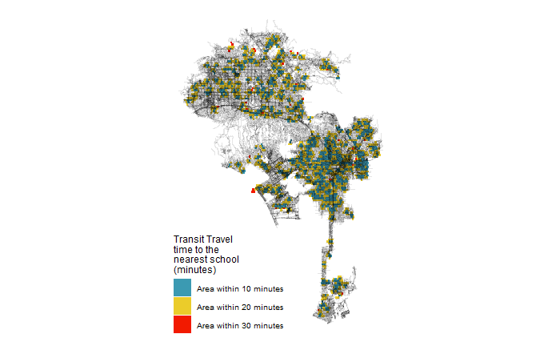

```{r setup, include=FALSE}
knitr::opts_chunk$set(echo = TRUE)
```

# Introduction

I have thoroughly enjoyed this class and am coming away from it feeling like I have developed concrete, useful skills. Here are the Spatial Analysis projects I am most interested in.

# Interactive Map of Webb County, Texas
I used American Community Survey data to see what percentage of the total population of each census tract were non-citizens who had remained in the same address for at least a year. Laredo, my hometown, is a militarized city that you cannot leave without crossing a checkpoint-- it is very difficult to be mobile as a non-citizen. Further, the areas with the lowest percentages, the north of the city, are also the wealthiest.

[](https://alecmartinezgsd.github.io/portfolio/fullsize/stuck.html){target="_blank"}


# Empowerment Zones by Shootings, Chicago, Illinois
I spent some time visiting family in Chicago over the summer, and I kept hearing about gun violence. I used this mapping opportunity to compare two things: empowerment zones, which are areas identified as distressed and high poverty but eligible to receive certain tax breaks and grants, and incidents of gun violence. Not much can be theorized from the map, but I did find something interesting: popular media often cites south side Chicago as the worst for gun violence, but the map clearly identifies a zone in the northwest as the highest gun violence zone.

[](https://alecmartinezgsd.github.io/portfolio/fullsize/empowerment.png){target="_blank"}


# Transit Access, Los Angeles, California
Speaking of Chicago, my mother recently moved to Los Angeles from Chicago and has been complaining about how hard it is to get around without a car. I figured I'd check out the situation using the power of data. Using GTFS feeds, I created several analyses around transit and access in the city.

## Transit Time to Nearest School, Los Angeles, California

[](https://alecmartinezgsd.github.io/portfolio/fullsize/isochrome.png){target="_blank"}

## Accessibility Scores (as quantified by walksheds around transit stops), Los Angeles, California

[](https://alecmartinezgsd.github.io/portfolio/fullsize/access.png){target="_blank"}

## Pedestrian Access to Transit Stops (two maps), Los Angeles, California

[](https://alecmartinezgsd.github.io/portfolio//fullsize/nebula.png){target="_blank"}

[](https://alecmartinezgsd.github.io/portfolio/fullsize/shape.pdf){target="_blank"}

# Crime in Honolulu, Hawaii
For this project, my team georeferenced a map of Honolulu from the early 1900s, generated crime data from public datasets, then overlayed it. The hot spots also happen to be the most popular tourist destinations.
[](https://alecmartinezgsd.github.io/portfolio/fullsize/Honolulu.png){target="_blank"}

